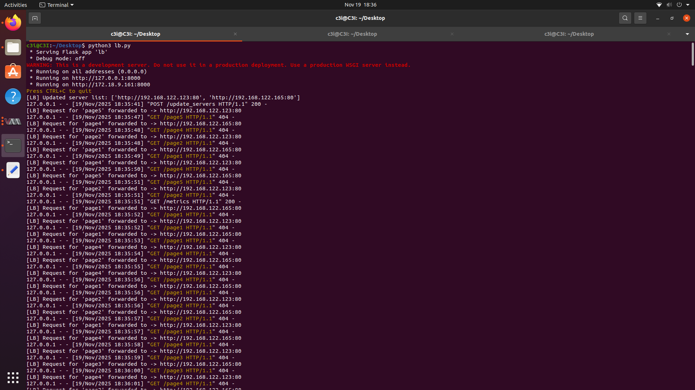
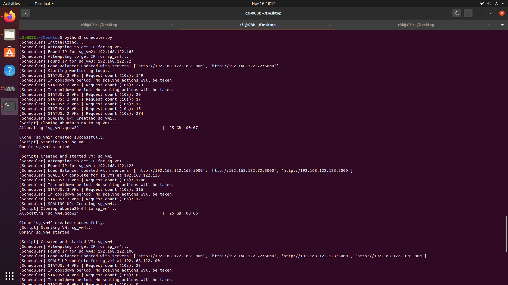
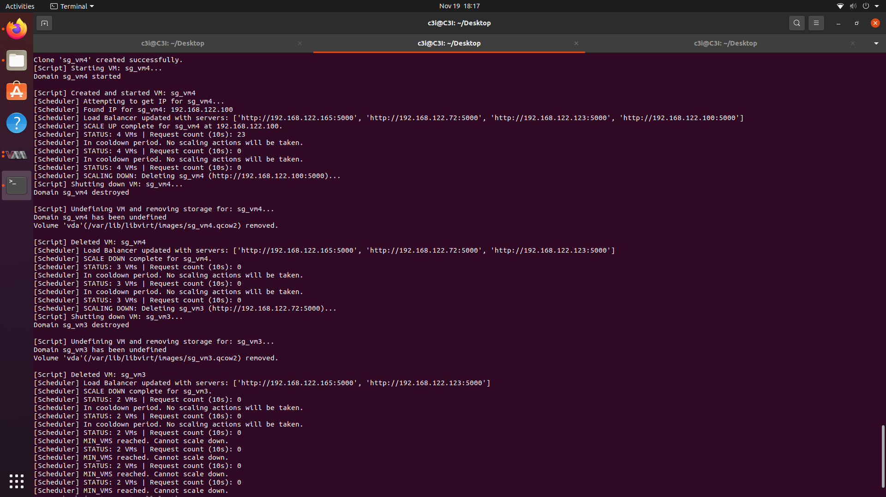

# ☁️ Auto-Scaling Cloud Simulation using Python, Flask, and KVM

This project demonstrates **automatic scaling of Virtual Machines (VMs)** based on **client load** using a custom-built **Scheduler**, **Load Balancer**, and **Scaling scripts**.  
It simulates the behavior of a real-world **cloud auto-scaling system** (like AWS EC2 Auto Scaling or Google Cloud Autoscaler) on a local KVM-QEMU environment.

---

## 🚀 Overview

The system intelligently scales **web server VMs** up or down depending on incoming request load.  
It uses a **round-robin load balancer** and a **Flask-based monitoring mechanism** to measure request rates and trigger scaling actions automatically.

---

## 🧩 Components

1. **Client Simulator (`client_sim.py`)**  
   Continuously sends random requests to the Load Balancer to simulate real-world varying user traffic.

2. **Load Balancer (`load_b.py`)**  
   Distributes incoming requests among available VMs using the Round-Robin algorithm and exposes metrics for the scheduler.

3. **Scheduler (`sch.py`)**  
   Monitors request counts every 10 seconds and automatically:
   - **Scales up** (creates new VM) when the load is high.
   - **Scales down** (removes VM) when the load is low.

4. **Scaling Scripts**
   - `scale_up.py`: Clones a new VM from a template using `virt-clone` and starts it.
   - `scale_down.py`: Stops and deletes an existing VM when scaling down.

---

## 🧱 Architecture

```text
        ┌──────────────────────┐
        │   Client Simulator   │
        └─────────┬────────────┘
                  │ HTTP Requests
                  ▼
        ┌──────────────────────┐
        │   Load Balancer      │
        │  (Flask, Round Robin)│
        └─────────┬────────────┘
                  │ Metrics (every 10s)
                  ▼
        ┌──────────────────────┐
        │     Scheduler        │
        │ (Scaling Logic)      │
        └─────────┬────────────┘
                  │
      ┌─────────┌─┴────────────────┐
      │         |                  │
      ▼         ▼                  ▼
┌─────────┐ ┌─────────┐       ┌────────────┐
│ web_vm1 │ | web_vm2 |  ...  │  web_vmN   │
└─────────┘ └─────────┘       └────────────┘
```

---

## ⚙️ Features

✅ Dynamic VM scaling (up/down)  
✅ Real-time load tracking using Flask APIs  
✅ Round-robin load distribution  
✅ Threshold-based scaling logic  
✅ Cooldown mechanism to prevent frequent scaling  
✅ Uses `libvirt` and `virt-clone` for VM management  

---

## 📁 Project Structure

```
├── client_sim.py        # Simulates client requests
├── load_b.py            # Load Balancer
├── sch.py               # Scheduler with scaling logic
├── scale_up.py          # VM creation script
├── scale_down.py        # VM deletion script
└── images/              # Folder for screenshots
```

---

## 🛠️ Prerequisites

Before running the project, ensure the following setup:

1. **Operating System:** Ubuntu 20.04+ (Linux with KVM support)
2. **Software Installed:**
   - `libvirt-daemon-system`
   - `virt-manager`
   - `qemu-kvm`
   - Python 3.8+
   - Flask and Requests libraries

   ```bash
   sudo apt install virt-manager libvirt-daemon-system qemu-kvm
   pip install flask requests
   ```

3. **VM Setup Requirements:**
   - Two **initial VMs** must be **already running**:
     ```
     web_vm1
     web_vm2
     ```
     These serve as the starting web servers for load balancing.
   - One **VM template** (used for scaling up) must be **present in a shut-down state**:
     ```
     ubuntu20.04-3_webTemplate
     ```
     The scheduler clones this template to create new VMs dynamically.

4. Ensure `virsh` and `virt-clone` commands are available in your system PATH.

---

## ▶️ Running the System

Follow these steps to run the complete setup:

### 1. Start the Load Balancer
```bash
python3 load_b.py
```

### 2. Run the Scheduler
```bash
python3 sch.py
```

### 3. Start the Client Simulator
```bash
python3 client_sim.py
```

The system will now:
- Handle requests via the load balancer.
- Automatically add or remove VMs based on request load.
- Log scaling events in the console.

---

## ⚖️ Scaling Logic

| Condition                       | Action            | Description                    |
|---------------------------------|-------------------|--------------------------------|
| Requests per VM > 20 (in 10s)   | 🔼 **Scale Up**   | Clone new VM from the template |
| Requests per VM < 5 (in 10s)    | 🔽 **Scale Down** | Shut down and remove a VM      |
| Within 30 seconds of last scale | ⏸ **Cooldown**   | No scaling performed           |

---

## 📊 Example Output

| Stage | Screenshot |
|:------|:------------|
| Load Balancer Running |  |
| Scheduler Scaling Up |  |
| Scheduler Scaling Down |  |

---

## 🧠 Future Enhancements

- Add a web dashboard for monitoring scaling in real time  
- Integrate Nginx or HAProxy as a production-grade load balancer  
- Store metrics and scaling history for analysis  
- Use machine learning for predictive scaling  

---

## 👨‍💻 Author

- **Shubham Gupta** 
- **Aman Kumar** 

---
